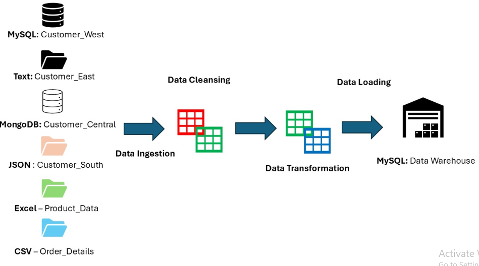

# Data Engineering Using Python
## Introduction
**Data Engineering** is a process of designing, building, and maintaining systems for collecting, storing, and analyzing large amounts of data. It involves transforming raw, unstructured data into a structured format that can be easily accessed and analyzed.

## About Project
- My Super Store is an organization that runs retail stores across different cities in United States to sell products belonging to multiple categories. 
- This organization keeps track of customer, product, and order data in a variety of files and databases in various formats. 
- This firm, by analyzing data, aims to uncover insights that may be used to improve business operations and decision-making, which helps to improve their revenue.
- To do so, a data warehouse has to be built for analytical purposes. Below are some of the requirements specified by My Super Store organization.

## Architecture

## Technology Used
1. Programming Language - Python
2. Scripting Language - SQL
3. Azure Cloud Platform

**Here is the dataset used:**  https://github.com/vinayd154/Data-Engineering-Using-Python/blob/main/DataSources.zip

## Scripts for project
1. [Extract Python Script](/main/Extract.py)
2. [Transform Python Script](main/Transform.py)
3. [Load Python Script](/main/load.py)
